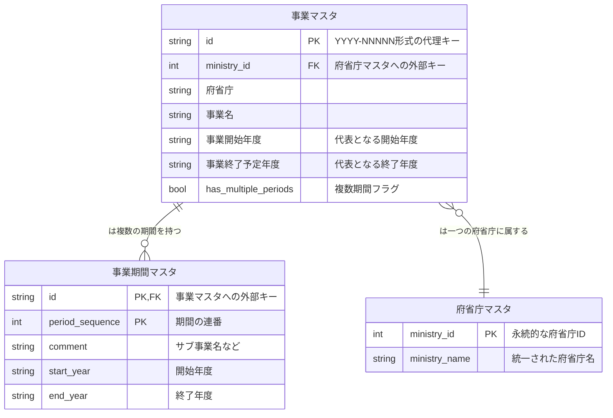

# 行政事業レビューシート データベース正規化プロジェクト (`gyoukaku_review_db`)

## 概要

本プロジェクトは、日本の行政改革推進本部が公開している「行政事業レビューシート」のデータベースを、機械判読可能で分析しやすい形式に正規化・構造化することを目的とします。

元データは年度ごとにフォーマットが異なり、数千から15,000を超える列を持つ巨大なワイド形式のExcelファイルとして提供されています。このままでは、年度をまたいだ横断的な分析や、データベースとしての利用が著しく困難です。

このプロジェクトでは、一連のPythonスクリプトを通じて、これらの複雑で巨大なデータをクリーンなリレーショナル形式のCSVファイル群（データベースのテーブルに相当）に変換します。

## 主な特徴

- **自動データ変換:** 元のZIP/Excelファイルから、シートごとにCSVファイルを自動生成します。
- **堅牢な日本語正規化:**
    - 和暦（明治、大正、昭和、平成、令和）から西暦への変換
    - 省略された元号の補完（例: `平成9～25年度` → `1997～2013`）
    - 全角/半角文字、ハイフンやチルダなどの記号の揺れを統一
    - `①`のようなリストマーカーが数値と連結しないように保護
- **構造化 (ワイドからロングへ):** 横に長く冗長な列（予算額、費目・使途など）を、縦持ちの正規化されたテーブルに変換します。
- **代理キーの生成:** 年度間のフォーマットの揺れを吸収するため、安定した一意なID（`business_id`, `ministry_id`）を生成します。
- **複雑なデータ構造の解析:** 1つのセルに複数の情報（サブ事業、複数期間）が改行で含まれているような複雑なケースを解析し、独立したテーブルに分割します。

## データソース

本プロジェクトで使用するデータは、以下の公式サイトから取得します。

- **行政事業レビューシートのデータベース:** [https://www.gyoukaku.go.jp/review/database/index.html](https://www.gyoukaku.go.jp/review/database/index.html)

## プロジェクト構成

```
gyoukaku_review_db/
│
├── .gitignore
├── README.md
├── LICENSE
├── requirements.txt
│
├── data/
│   ├── download/          # 元のzip, xlsxを格納
│   ├── raw/               # シートごとにCSVへ変換した生データを格納
│   ├── normalized/        # 文字揺れ等を正規化したデータを格納
│   └── processed/         # 最終的な成果物（正規化済みテーブル）を格納
│       ├── ministry_master.csv
│       ├── business_master.csv
│       └── business_period_master.csv
│
├── src/
│   ├── config.py          # 府省庁マスターの定義など、プロジェクトの設定
│   ├── lib/
│   │   └── normalization.py # 日本語正規化のコアロジック
│   └── scripts/
│       ├── 01_convert_to_csv.py
│       ├── 02_normalize_data.py
│       ├── (03-05_analysis...)
│       ├── 06_build_final_masters.py
│       └── 07_build_business_master.py
│
└── analysis/
    └── (分析過程で生成された中間ファイル)
```

## セットアップ手順

1.  **リポジトリをクローン**
    ```bash
    git clone [リポジトリのURL]
    cd gyoukaku_review_db
    ```

2.  **Python仮想環境の構築**
    ```bash
    python -m venv venv
    # Windowsの場合
    .\venv\Scripts\activate
    # macOS/Linuxの場合
    source venv/bin/activate
    ```

3.  **必要なライブラリをインストール**
    ```bash
    pip install -r requirements.txt
    ```

4.  **元データのダウンロード**
    上記の「データソース」から元データをダウンロードし、zipファイルおよびxlsxファイルを `data/download/` ディレクトリに配置してください。

## 実行パイプライン

以下のスクリプトを**番号順に**実行してください。`-m` オプションを使用することで、モジュールのパス問題を回避できます。

1.  **Excel/ZIP -> 生CSVへ変換**
    ```bash
    python -m src.scripts.01_convert_to_csv
    ```
    -   **入力:** `data/download/`
    -   **出力:** `data/raw/`

2.  **生CSV -> 正規化済みCSVへ変換**
    ```bash
    python -m src.scripts.02_normalize_data
    ```
    -   **入力:** `data/raw/`
    -   **出力:** `data/normalized/`

3.  **府省庁マスターの生成**
    ```bash
    python -m src.scripts.06_build_final_masters
    ```
    -   **入力:** `src/config.py`
    -   **出力:** `data/processed/ministry_master.csv`

4.  **事業マスタ・事業期間マスタの生成**
    ```bash
    python -m src.scripts.07_build_business_master
    ```
    -   **入力:** `data/normalized/`
    -   **出力:** `data/processed/business_master.csv`, `data/processed/business_period_master.csv`

## 最終的なデータモデル (ER図)

このパイプラインによって生成される主要なテーブルの関係は以下の通りです。



## ライセンス

このプロジェクトは[MITライセンス](LICENSE)の下で公開されています。